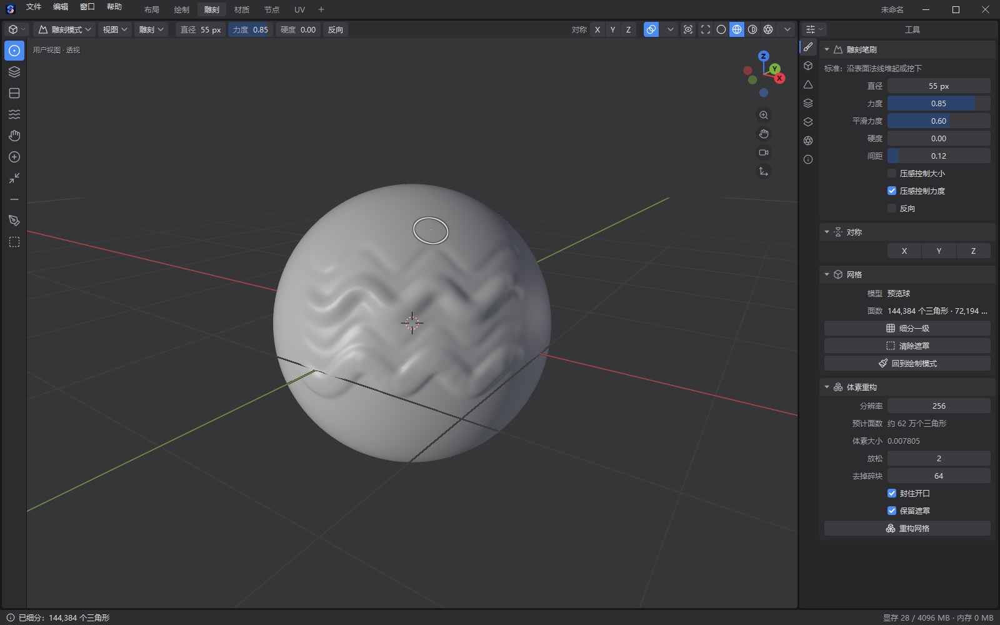
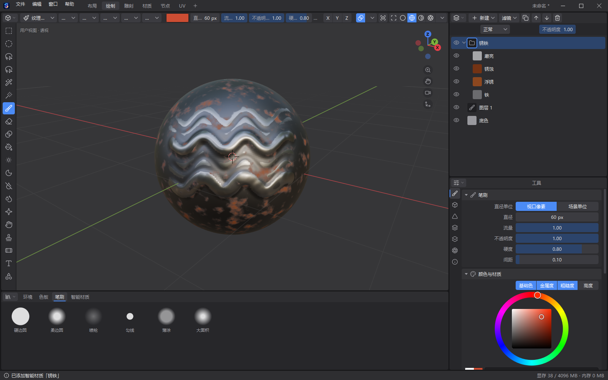
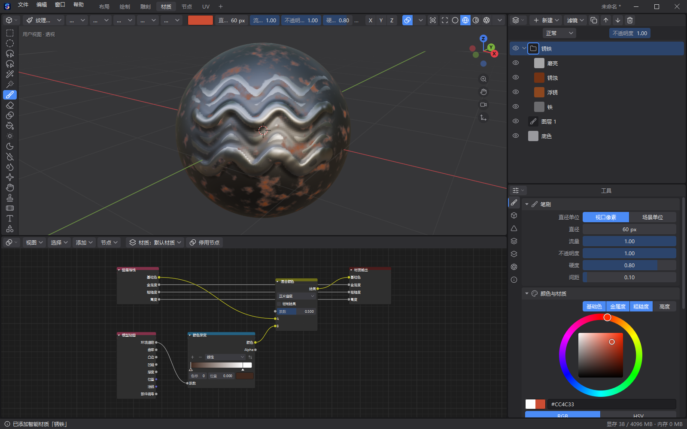
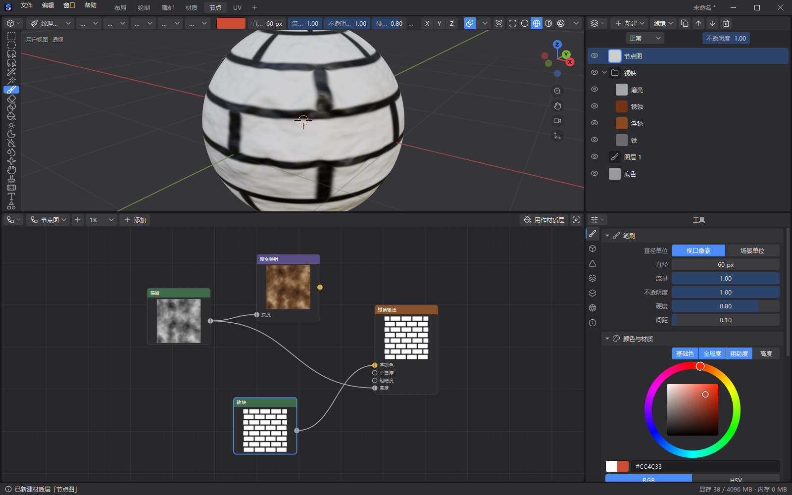
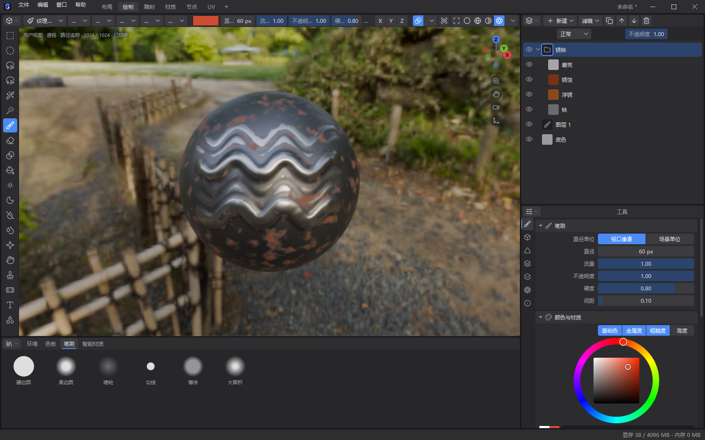
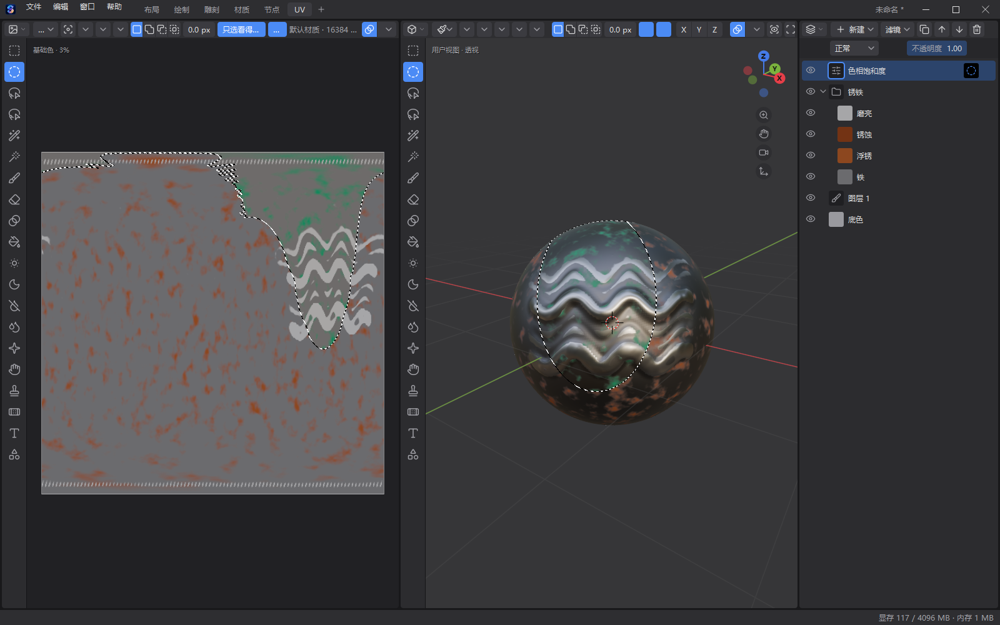

# SPLENDER

把 ZBrush、Substance Painter、Substance Designer、Blender 的工作合在一个程序里，再加上 Photoshop 的图像编辑：雕刻、流畅绘制 16K 贴图、程序化材质、内置渲染器，功能像 Blender 一样由插件组成。

> An all-in-one app for sculpting, 16K texture painting, procedural materials and rendering (Python + ModernGL, Chinese UI).

现在完成的是：程序骨架和插件系统；物体模式、编辑模式；雕刻（十种笔刷、细分、体素重构、自动展开 UV）；流畅绘制 16K 贴图（图层和文件夹，Photoshop 的调整层、滤镜、绘制工具和选区）；模型贴图烘焙、生成器蒙版和 11 种智能材质；材质节点和节点纹理；四个渲染引擎（工作台、实时、路径追踪、Arnold 插件）。每一版的变化见 [docs/CHANGELOG.md](docs/CHANGELOG.md)。方案、进度和实测数据见 [docs/SPLENDER_PLAN_v2.md](docs/SPLENDER_PLAN_v2.md)，代码约定见 [docs/ARCHITECTURE.md](docs/ARCHITECTURE.md)。

## 截图

| | |
|---|---|
|  |  |
| 雕刻：细分、十种雕刻笔刷、体素重构 | 绘制：烘焙模型贴图后加上智能材质「锈铁」 |
|  |  |
| 材质节点：图层的颜色乘上按遮蔽取的颜色渐变 | 节点纹理：程序化的砖块用作材质层 |
|  |  |
| 视口里实时路径追踪（带降噪） | 在模型上框选，选区里加色相饱和度调整层；左边 UV 视图里是同一块 |

## 下载和打开

- **便携包**：到 [Releases](../../releases) 下载 `SPLENDER-版本-日期.zip`，解压到任意位置，双击 `SPLENDER.exe`。自带 Python 和所有库，不用装别的。需要 Windows 10 或 11（64 位），显卡支持 OpenGL 4.3。
- **从源码运行**：装 64 位 Python 3.11，`pip install -r requirements.txt`，然后在仓库目录里运行 `python -m splender`。
- **自己打便携包**：`python tools/make_package.py`，在上一级目录的 `SPLENDER_dist` 里得到 zip。启动器 `SPLENDER.exe` 的源码在 `tools/launcher/`。

第一次打开是一个预览球，可以直接画。用「文件 → 导入模型」换成自己的模型（OBJ、glTF、GLB）。

## 常用操作

键位、菜单、模式和 Blender 4.3 默认一致（左键选择）。3D 视口左上角的下拉框换模式：物体模式、编辑模式、雕刻模式、
纹理绘制；Tab 进出编辑模式，Ctrl+Tab 在鼠标处弹出模式饼菜单。顶部的工作区只是几套布局，任何工作区里都能换模式。

通用：

| 操作 | 按键 |
|---|---|
| 旋转、平移、缩放视图 | 中键拖动、Shift+中键、滚轮或 Ctrl+中键 |
| 前、右、顶视图（加 Ctrl 看反面，加 Shift 对齐当前物体） | 小键盘 1、3、7 |
| 透视 / 正交、按步旋转、平移、滚转 | 小键盘 5；小键盘 2/4/6/8、9；Ctrl+小键盘 2/4/6/8；Shift+小键盘 4/6 |
| 看全部、看所选、视图饼菜单 | Home、小键盘 .、` |
| 从摄像机看、摄像机对准视图、设当前物体为摄像机 | 小键盘 0、Ctrl+Alt+小键盘 0、Ctrl+小键盘 0 |
| 局部视图、框选放大、漫游 | /、Shift+B、Shift+` |
| 着色饼菜单、线框、X 光、叠加层开关 | Z、Shift+Z、Alt+Z、Shift+Alt+Z |
| 3D 游标放到鼠标处、吸附饼菜单 | Shift+右键、Shift+S |
| 轴心点、坐标系饼菜单、吸附开关 | .、,、Shift+Tab |
| 撤销、重做、调整上一步、重复上一步 | Ctrl+Z、Ctrl+Shift+Z、F9、Shift+R |
| 搜索任何命令、改名、文件菜单 | F3、F2、F4 |
| 区域最大化、工具栏、侧栏 | Ctrl+空格、T、N |
| 保存、增量保存、打开、导入模型、导出贴图 | Ctrl+S、Ctrl+Alt+S、Ctrl+O、Ctrl+I、Ctrl+Shift+E |
| 出最终图（有摄像机就从摄像机出图） | F12 |

物体模式（「布局」工作区）：

| 操作 | 按键 |
|---|---|
| 选择 / 加选或减选 / 列出鼠标下的物体 | 左键 / Shift+左键 / Alt+左键 |
| 框选、刷选、套索 | 左键拖动或 B、C、Ctrl+右键拖动 |
| 全选、全不选、反选 | A、Alt+A、Ctrl+I |
| 移动、旋转、缩放（接着按 X/Y/Z 约束，Shift+轴是平面，直接输入数字） | G、R、S |
| 清除位置、旋转、缩放；应用变换 | Alt+G、Alt+R、Alt+S；Ctrl+A |
| 添加（网格基本体、摄像机、灯光、空物体） | Shift+A |
| 复制、删除、合并、镜像 | Shift+D、X 或 Delete、Ctrl+J、Ctrl+M |
| 隐藏所选、隐藏未选、全部显示 | H、Shift+H、Alt+H |
| 物体右键菜单、关联材质 | 右键、Ctrl+L |

工具栏里的移动、旋转、缩放工具（物体模式和编辑模式都有）显示操纵杆：拖箭头沿轴走、拖小方块在平面里走、拖中间的圈随便动；
旋转工具拖彩色环绕轴转、拖外面的白环绕视线转；缩放工具拖轴沿轴缩放、拖中间的圈整体缩放。

编辑模式（Tab）：

| 操作 | 按键 |
|---|---|
| 点、边、面选择（Shift 同时用几种，Ctrl 按现在的选中扩展） | 1、2、3 |
| 选择 / 加选或减选 / 循环边 / 并排边 / 最短路径 | 左键 / Shift+左键 / Alt+左键 / Ctrl+Alt+左键 / Ctrl+左键 |
| 全选、全不选、反选、扩大缩小选区 | A、Alt+A、Ctrl+I、Ctrl+小键盘 + 和 − |
| 选相连（鼠标下的 / 选中的）、选相似、镜像选择 | L 或 Shift+L、Ctrl+L、Shift+G、Ctrl+Shift+M |
| 移动、旋转、缩放（X/Y/Z 约束，再按一次换坐标系；输入数字）；连按两次 G 滑移边 | G、R、S；G G |
| 衰减编辑开关、衰减方式、只影响相连的（变换时滚轮改范围） | O、Shift+O、Alt+O |
| 挤出、挤出菜单、内插、倒角边、倒角点 | E、Alt+E、I、Ctrl+B、Ctrl+Shift+B |
| 环切、切刀、连接顶点、撕开（补缝）、滑移顶点 | Ctrl+R、K、J、V（Alt+V）、Shift+V |
| 填充、补洞、复制、拆分、分离 | F、Alt+F、Shift+D、Y、P |
| 合并、拆分菜单、删除菜单、融并 | M、Alt+M、X、Ctrl+X |
| 点、边、面菜单，UV 菜单，法线菜单 | Ctrl+V、Ctrl+E、Ctrl+F，U，Alt+N |
| 重新计算法线（朝外 / 朝内）、三角化、三角转四边 | Shift+N / Ctrl+Shift+N、Ctrl+T、Alt+J |
| 隐藏所选、隐藏未选、全部显示 | H、Shift+H、Alt+H |
| 加形体（加进当前网格）、挤出到鼠标处、右键菜单 | Shift+A、Ctrl+右键、右键 |
| 球形化、切变、镜像、法向缩放 | Shift+Alt+S、Ctrl+Shift+Alt+S、Ctrl+M、Alt+S |

工具栏里的挤出、内插、倒角、法向缩放、平滑工具：在选中的部分上按住拖动；在别处拖动是框选。环切工具指着边按下就切，
拖动滑位置。切刀工具点出切线后回车。

纹理绘制（也照顾 Photoshop 的习惯）：

| 操作 | 按键 |
|---|---|
| 画 / 擦 | 左键 / Ctrl+左键（橡皮工具时反过来） |
| 画笔、橡皮 | B、E |
| 笔刷大小、流量、硬度 | F、Shift+F、Ctrl+F，移动鼠标调整；或 [ 和 ] |
| 笔刷设置浮层 | 右键 |
| 取色、交换前后色、默认黑白色 | Shift+X、I 或 Alt+左键；X；D |
| 不透明度、流量（1 是 10%，0 是 100%） | 数字键、Shift+数字键 |
| 稳定器开关 | Shift+S |
| 新图层、复制图层、编组 | Ctrl+Shift+N、Ctrl+J、Ctrl+G |
| 色阶、曲线、色相饱和度、色彩平衡、黑白、反相、去色（调整层） | Ctrl+L、Ctrl+M、Ctrl+U、Ctrl+B、Ctrl+Alt+Shift+B、Ctrl+I、Ctrl+Shift+U |
| 自动色调、自动对比度、自动颜色 | Ctrl+Shift+L、Ctrl+Alt+Shift+L、Ctrl+Shift+B |
| 用前景色、背景色填一层 | Alt+Backspace、Ctrl+Backspace |

调整层和 Photoshop 的一样（图层「新建 → 调整层」）：亮度对比度、色阶（分通道，带直方图，拖三角改）、曲线（分通道，带直方图）、曝光度、自然饱和度、色相饱和度（可以只改某一类颜色，也可以着色）、色彩平衡、黑白、照片滤镜、通道混合器、颜色查找（内置几种风格，也能导入、导出 .cube）、反相、色调分离、阈值、渐变映射、可选颜色。调整面板标题右边是预设；新建的调整层先只改颜色，要连金属度、粗糙度、高度一起改就在「作用于」里打开。

滤镜也和 Photoshop 的一样（绘制模式和图像编辑器标题栏的「滤镜」、图层编辑器的「滤镜」）：高斯模糊、动感模糊、径向模糊、表面模糊、锐化、USM 锐化、添加杂色、中间值、浮雕效果、马赛克、云彩、高反差保留、最小值、最大值。直接改当前绘制层（画蒙版时改蒙版），做完在视口左下角改参数，Shift+R 再来一次，可以撤销。

绘制模式和 UV 视图的工具栏里还有 Photoshop 的这些工具（UV 视图也有工具栏，T 开关）：

| 工具 | 用法 | 按键 |
|---|---|---|
| 渐变 | 拖一条线：线性、径向、角度、对称、菱形，笔刷颜色到备用颜色或自定色带；在模型上拉按屏幕方向铺（第一次会先准备模型贴图，好了自动铺上） | G（再按换油漆桶） |
| 油漆桶 | 点一下：相近颜色（容差、连续、对所有图层取样）、整块 UV 岛、整个网格部件或整层 | G |
| 减淡、加深、海绵 | 划过的地方变亮、变暗、变灰或变艳；按住 Ctrl 反过来 | O |
| 模糊、锐化、涂抹 | 划过的地方变糊、变清楚，或把颜色往拖的方向带 | R |
| 仿制图章、修复画笔 | 按住 Alt 点一下定来源，再划；修复画笔的颜色明暗跟着周围走 | S、J |
| 选区 | 矩形、椭圆选框（M）、套索、多边形套索（L）、快速选择、魔棒（W）。拖之前按住 Shift 添加、Alt 减去、Shift+Alt 交叉；有选区时画笔、滤镜、填充只改选区里面 | M、L、W |
| 选择菜单 | 全选 Ctrl+A、取消选择 Ctrl+D、重新选择 Ctrl+Shift+D、反选 Ctrl+Shift+I、羽化 Shift+F6，修改里还有扩展、收缩、平滑、边界；有选区时 Ctrl+J 只复制选区里的、Ctrl+Shift+J 剪切到新图层、Delete 清除 | |
| 文字、形状 | 点一下写字（字体、字号、粗斜体、旋转、对齐）；拖出矩形、圆角矩形、椭圆、多边形、直线（Shift 等比、Alt 从中心）。字号、描边按屏幕像素；在模型上正对屏幕投上去，只盖看得见的地方 | U（形状） |

这些工具都按笔刷开着的通道（颜色、金属度、粗糙度、高度）一起改，画蒙版时改蒙版；做完能在视口左下角改参数（文字还能改字）、Shift+R 再来一次、撤销。

鼠标停在任何数值、颜色、下拉框上：Ctrl+C / Ctrl+V 复制粘贴、Backspace 恢复默认值、减号取反、Ctrl+滚轮改值或换下一项、
颜色上按 E 用吸管在屏幕上任意处取色。纹理集的分辨率在属性「纹理集」页里随时能改（256 到 16K），画过的内容跟着重新采样。

雕刻模式：

| 操作 | 按键 |
|---|---|
| 雕刻 / 反向 / 临时平滑 | 左键 / Ctrl+左键 / Shift+左键 |
| 标准、平滑、捏合、膨胀、抓取、压平、黏土条、折痕、遮罩 | V、S、P、I、G、Shift+T、C、Shift+C、M |
| 笔刷直径、力度、硬度 | F、Shift+F、Ctrl+F |
| 遮罩饼菜单、反转遮罩、清除遮罩 | A、Ctrl+I、Alt+M |
| 框选遮罩（左键遮住、中键放开）、套索遮住、套索放开 | B、Ctrl+Shift+右键拖、Ctrl+右键拖 |
| 细分一级、体素重构 | Ctrl+D、Ctrl+R |

重构过的模型没有 UV，回到绘制模式时会自动展开；也可以在属性编辑器的「模型」页手动展开。

节点编辑器（「节点」工作区）：

| 操作 | 按键 |
|---|---|
| 连线 / 改接、断开 | 从输出口拖到输入口 / 拖已经接着线的输入口 |
| 加节点 | 右键空白处，或 Shift+A |
| 删除、复制 | X 或 Delete、Ctrl+D |
| 看全部、平移、缩放 | Home、中键拖动、滚轮 |

UV 编辑器里选画笔也能直接画：左键画、Ctrl+左键擦、[ 和 ] 调大小；小键盘 1、2、4、8 按比例看（Ctrl+小键盘 2、4、8 放大），
Shift+B 框选放大，Ctrl+1 一比一，Ctrl+0 看全部。分隔缝上点右键可以拆分、合并、交换两边的区域。

窗口的每一块都能拆分、合并、换成别的编辑器，拖区域的角或在区域标题栏上右键（Shift+F5/F7/F9/F10/F3 直接换成 3D 视口、属性、大纲视图、图像编辑器、节点编辑器）。顶部的「布局、绘制、雕刻、材质、节点、UV」是六套布局，可以自己加。

场景里可以有很多物体：Shift+A 加网格、摄像机、灯光、空物体，大纲视图里点选、改名、开关显示，属性编辑器的「物体」页改位置、旋转、缩放，「数据」页改摄像机的镜头、景深，灯光的颜色、功率。灯光和摄像机在路径追踪和 Arnold 出图里都用上。

插件在「编辑 → 偏好设置 → 插件」里启用、停用和安装，Arnold 渲染器就是一个内置插件。

智能材质在资源库的「智能材质」页，点一下就加到当前纹理集；也可以从图层的「新建 → 智能材质」加。它们按模型贴图（遮蔽、曲率、厚度等）决定落在哪里，第一次用时会自动烘焙。模型贴图在属性编辑器「纹理集」页的「模型贴图」面板里调和重烘，图层的「生成器」面板可以把任何图层变成按形状自动落位的图层；「智能遮罩」一键套用边缘磨损、缝里积灰之类的设置，「部件」生成器在视口里点选模型的零件。

指定高模后烘出法线贴图，视口和出图都会用上；导出时「法线」通道把它和手绘高度的凹凸合成一张（OpenGL 或 DirectX）。导出哪些通道、多大、文件怎么命名，在「纹理集」页的「导出」面板里设。

节点图做程序化材质：在「节点」工作区新建节点图，拼好后点「用作材质层」，或者在填充层的「来源」里选它；平铺次数和偏移在填充层里调。

材质节点（「材质」工作区下面的着色器编辑器，和 Blender 一样）：点「使用节点」后，图层堆栈是一个节点、接到材质输出；
中间可以接纹理（噪波、沃罗诺伊、波浪、渐变、棋盘格、砖块、节点图）、颜色渐变、混合颜色、运算、模型贴图（遮蔽、曲率、厚度……）。
节点上直接改数值和色带，视口、出图、导出都按纹素算。

| 操作 | 按键 |
|---|---|
| 加节点（加完跟着鼠标走，点一下放下） | Shift+A |
| 删除 / 删除并接通前后的线 | X 或 Delete / Ctrl+X |
| 复制、复制到剪贴板、粘贴 | Shift+D、Ctrl+C、Ctrl+V |
| 静音、折叠、连接选中的节点、移动 | M、H、F、G |
| 连线 / 改接、断开 / 割断连线 | 从输出口拖到输入口 / 拖接着线的输入口 / Ctrl+右键拖过 |
| 全选、全不选、反选、看全部、看选中、节点菜单 | A、Alt+A、Ctrl+I、Home、小键盘 .、右键 |

## 目录

| 位置 | 内容 |
|---|---|
| `splender/` | 程序本体 |
| `tests_new/` | 自动测试：`python tests_new/run_all.py` 单元测试，`python tests_new/run_selftests.py` 整机自检（窗口在屏幕外） |
| `tools/` | 打包、拍截图、跑分、性能分析、资源转换、生成图标和快捷方式的脚本；启动器源码在 `tools/launcher/` |
| `docs/` | 方案、代码约定、更新记录、截图 |
| `requirements.txt` | 从源码运行要装的库 |
| `SPLENDER.exe`、`runtime/` | 便携包里才有：启动器，自带的 Python 和库 |

## 设置和日志

偏好设置在「编辑 → 偏好设置」，内存预算、绘制手感、视口质量等都能调。设置和日志保存在 `%APPDATA%\SPLENDER\`。

## 许可证

SPLENDER 按 [GNU AGPL-3.0](LICENSE) 发布。用到的第三方库和自带素材见 [THIRD_PARTY_NOTICES.md](THIRD_PARTY_NOTICES.md)。

